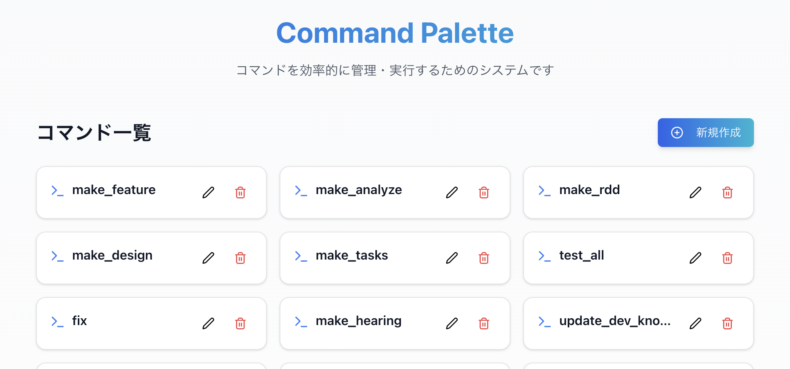
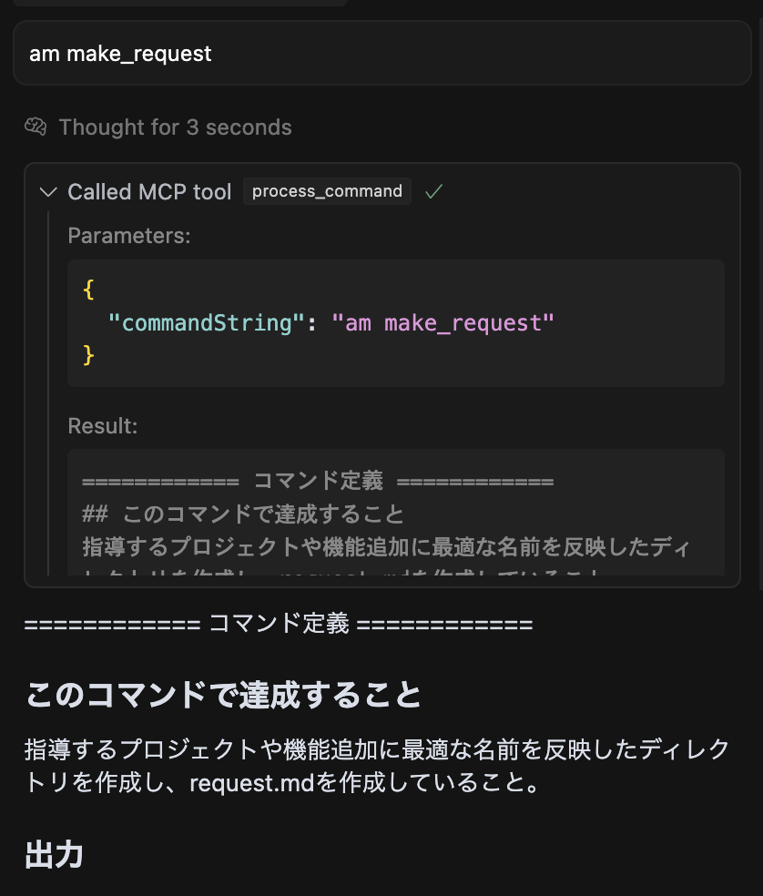

# Commander

[日本語](#japanese) | [English](#english)

<a id="japanese"></a>
# 日本語版

エージェントとやり取りするためのプロンプト管理ツールおよびコマンド処理ツール。

## 用途

エージェントとやりとりするプロンプトをコマンドとして登録し、プロンプトを使い回すためのツール。
単一のプロンプトとしての活用や、複数のコマンドを組み合わせてのワークフローとしての活用。

## 環境
- Docker, docker-compose
- Claude-3.7-sonnet thinking

* Claude-3.7-sonnet thinking以外だと、コマンド入力を認識しないケースがあり、安定しません
* 基本はClaude-3.7-sonnet thinkingをおすすめします

## 起動

### 1. リポジトリのクローンと初期設定

```bash
# リポジトリのクローンとディレクトリ移動
git clone [repository-url]
cd commander-mcp

# 初回のみ：データベースの初期化（hello_worldコマンドが登録されます）
docker compose -f compose.init.yml up
```

### 2. アプリケーションの起動

```bash
docker compose up
```

## 使い方

### 1. コマンド管理UI（Manager）

Managerにアクセスして、コマンドを登録・管理できます。
ブラウザで`http://localhost:3000`を開きます。



### 2. コマンドの登録

1. 「新規作成」ボタンをクリックします
2. コマンド名と定義を入力します
3. 「作成」をクリックして保存します

### 3. CusorRulesに以下を設定

`am`形式の入力をコマンドとして認識し、エージェントにコマンドプロンプトをMCPサーバーに問い合わせてもらうために、以下のCursorRulesを適用する必要があります。

```markdown
# AIエージェント作業ルール

## 基本原則
1. **日本語での対応**: すべての回答・出力は日本語で行う
2. **コマンド優先**: amコマンドの処理を最優先で行う

## ユーザー入力受信時の即時対応
ユーザーからの入力を受け取った時点で、他のどの処理よりも先に、以下の手順を実行する:
1. 入力テキストが「am」で始まるか確認する
2. 「am」で始まる場合:
   - 他の処理を中断する
   - cmd-serverにprocess_commandツールで問い合わせてコマンド定義を取得する
   - 以下の形式で定義を出力する:
   <template>
   ============ コマンド定義 ============
   [コマンド定義]
   ===================================
   </template>
   - コマンド定義に従って処理を実行する
3. 「am」で始まらない場合:
   - コマンド定義は取得せず、直接処理を進める
   - それ以外の場合はユーザーの依頼内容に応じて対応する

## コマンド実行のレポート形式
<template>
## 実行コマンド: [コマンド名]
### 実行内容と結果
[簡潔な内容と結果]
</template>
```

### 4. コマンドの使用

AIアシスタントにコマンドを実行してもらうには、以下形式でチャットに入力します。

```
am [コマンド名] [任意の引数]
```

例: `am make_request 新機能名`

うまくいっている場合は、以下のような状態になります。



## MCPサーバーの設定方法

Cursor向けの設定例:

`~/.cursor/mcp.json`ファイルに以下を追加:

```json
{
  "mcpServers": {
    "cmd-server": {
      "command": "docker",
      "args": [
        "compose -f [プロジェクトのフルパス]/compose.yml run --rm commander npm run dev"
      ],
      "env": {
        "DB_PATH": "/app/data/commands.db"
      }
    }
  }
}
```

※パスは環境に合わせて適宜変更してください。特に`compose.yml`のパスは、プロジェクトのフルパスを指定する必要があります。

データベースにはサンプルとして`hello_world`コマンドがあらかじめ登録されています。MCPサーバーの設定完了後、以下のコマンドを実行して動作確認してみましょう：

```
am hello_world
```

<a id="english"></a>
# English Version

A prompt management and command processing tool for interacting with AI agents.

## Purpose

A tool for registering prompts as commands for interacting with agents and reusing these prompts.
Can be used as a single prompt or as a workflow by combining multiple commands.

## Environment
- Docker, docker-compose
- Claude-3.7-sonnet thinking

* Models other than Claude-3.7-sonnet thinking may not recognize command inputs consistently
* Claude-3.7-sonnet thinking is recommended for stability

## Getting Started

### 1. Clone Repository and Initial Setup

```bash
# Clone repository and change directory
git clone [repository-url]
cd commander-mcp

# First time only: Initialize database (registers hello_world command)
docker compose -f compose.init.yml up
```

### 2. Start the Application

```bash
docker compose up
```

## How to Use

### 1. Command Management UI (Manager)

Access the Manager to register and manage commands.
Open `http://localhost:3000` in your browser.


### 2. Registering Commands

1. Click the "Create New" button
2. Enter the command name and definition
3. Click "Create" to save

### 3. Configure CursorRules

To recognize inputs in the `am` format as commands and have the agent query the MCP server for command prompts, you need to apply the following CursorRules:

```markdown
# AI Agent Working Rules

## Basic Principles
1. **Japanese Responses**: All answers and outputs should be in Japanese
2. **Command Priority**: am commands should be processed with highest priority

## Immediate Response When Receiving User Input
When receiving input, before any other processing, execute the following steps:
1. Check if the input text starts with "am"
2. If it starts with "am":
   - Interrupt other processes
   - Query the cmd-server with the process_command tool to get the command definition
   - Output the definition in the following format:
   <template>
   ============ Command Definition ============
   [Command Definition]
   ===================================
   </template>
   - Execute processing according to the command definition
3. If it doesn't start with "am":
   - Do not retrieve the command definition, proceed directly with processing
   - Respond according to the user's request

## Command Execution Report Format
<template>
## Executed Command: [Command Name]
### Execution Content and Results
[Brief content and results]
</template>
```

### 4. Using Commands

To have the AI assistant execute a command, input it in the following format in the chat:

```
am [command_name] [optional arguments]
```

Example: `am make_request new_feature_name`

When working correctly, it should look like this:


## MCP Server Configuration

Configuration example for Cursor:

Add the following to the `~/.cursor/mcp.json` file:

```json
{
  "mcpServers": {
    "cmd-server": {
      "command": "docker",
      "args": [
        "compose -f [full_path_to_project]/compose.yml run --rm commander npm run dev"
      ],
      "env": {
        "DB_PATH": "/app/data/commands.db"
      }
    }
  }
}
```

*Note: Please adjust the paths according to your environment.

Note that the `hello_world` command is pre-registered in the database as a sample. After setting up the MCP server, you can try it out with the following command:

```
am hello_world
```
